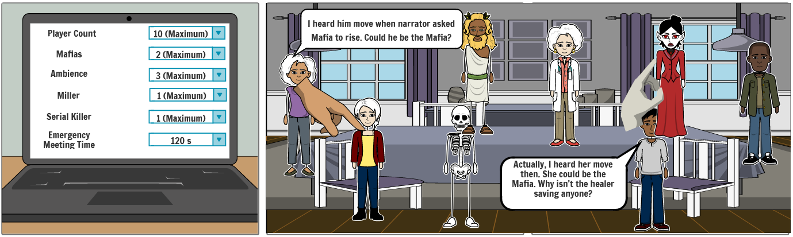
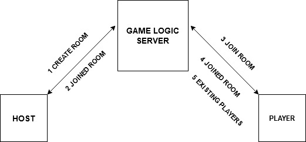

# CSE_218_118_Fa20_Team_Immersive_Truth

# Mafia VR

This project has been developed for the course project of CSE 118/218 Ubiquitous Computing Systems during Fall 2020.
As we are currently under some form of "stay at home" orders, we are separated from our friends and family. 
This has had a severe impact on the mental health of people as shown in figure 1.

It is a known fact that socially interactive games help reduce the stress levels of the players. 
With an aim to reduce the anxiety levels of people, we have attempted to combine one of the paradigms of 
ubiquitous computing technologies (Virtual Reality) with a popular house party game popularly referred to as **MafiaVR**.

To give you a gist of how this game is played, please refer to the following storyboard.

Each player that plays the game would be assigned a role that they need to stick to.

**Roles in Mafia VR**

1. Villager - Sleep during night phase and discuss during the day phases to successfully guess the Mafia.
2. Narrator - Conducts the entire game through all the phases, informs everyone as to who is alive/dead. Knows the role of every person playing the game. Controls the entire game
3. Mafia - Primary job is to eliminate all the others playing the game. Confuse others by identifying the wrong person as the Mafia without getting caught in the game
4. Sheriff / Police / Detective - Interrogate anyone to which the person being interrogated has to truthfully reveal their role in the game. Also participates in discussions.
5. Doctor - Could choose to save someone before the Mafia decides whom to kill. Doctor could participate in discussions to help identify the Mafia.

There are other roles which are used in Mafia, but aren't commonly seen in the traditional version of this game -

1. Serial Killer - A player other than Mafia who could kill villagers / civilians during the night phase of the game.
2. Godfather - Immune to interrogation by sheriff. Pretends to be a villager during interrogation. 
True Mafia leader and performs an extra kill after the Mafia goes to sleep
3. Miller - Miller would appear guilty during an interrogation even though he is an innocent outsider.

**Game Setup**

1. Interaction with the UI for the web-application looks as follows -

2. Interaction with the game flow looks as follows -

3. Conclusion of a game -

4. WebRTC Architecture -

