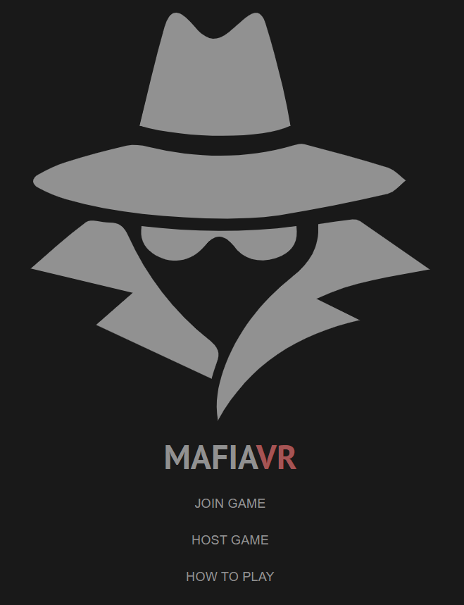
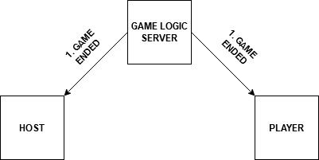
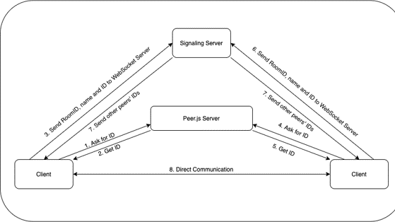
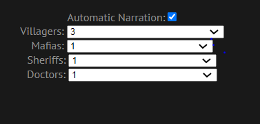
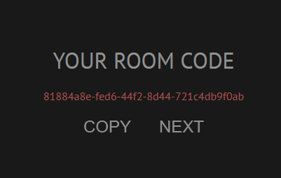
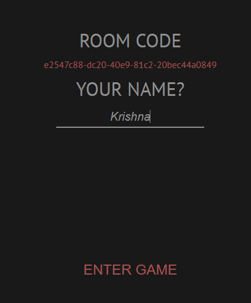
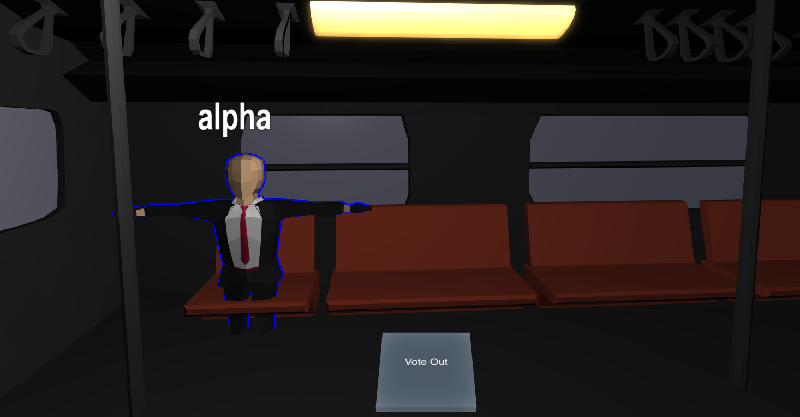

# CSE_218_118_Fa20_Team_Immersive_Truth

# Mafia VR

This project has been developed for the course project of CSE 118/218 Ubiquitous Computing Systems during Fall 2020.
As we are currently under some form of "stay at home" orders, we are separated from our friends and family. 
This has had a severe impact on the mental health of people as shown in figure 1.

It is a known fact that socially interactive games help reduce the stress levels of the players. 
With an aim to reduce the anxiety levels of people, we have attempted to combine one of the paradigms of 
ubiquitous computing technologies (Virtual Reality) with a popular house party game popularly referred to as **MafiaVR**.

To give you a gist of how this game is played, please refer to the following storyboard.

Each player that plays the game would be assigned a role that they need to stick to.

**Roles in Mafia VR**

1. Villager - Sleep during night phase and discuss during the day phases to successfully guess the Mafia.
2. Narrator - Conducts the entire game through all the phases, informs everyone as to who is alive/dead. Knows the role of every person playing the game. Controls the entire game
3. Mafia - Primary job is to eliminate all the others playing the game. Confuse others by identifying the wrong person as the Mafia without getting caught in the game
4. Sheriff / Police / Detective - Interrogate anyone to which the person being interrogated has to truthfully reveal their role in the game. Also participates in discussions.
5. Doctor - Could choose to save someone before the Mafia decides whom to kill. Doctor could participate in discussions to help identify the Mafia.

There are other roles which are used in Mafia, but aren't commonly seen in the traditional version of this game -

1. Serial Killer - A player other than Mafia who could kill villagers / civilians during the night phase of the game.
2. Godfather - Immune to interrogation by sheriff. Pretends to be a villager during interrogation. 
True Mafia leader and performs an extra kill after the Mafia goes to sleep
3. Miller - Miller would appear guilty during an interrogation even though he is an innocent outsider.

**Game Setup**

1. Interaction with the UI for the web-application looks as follows -

2. Interaction with the game flow looks as follows -

Description of events during the setup of the game

  2.1. Create Room (Host -> Server) - Set the configuration for the room by choosing the different characters to play the game.
  
  2.2. Joined room (Server -> Host) - Inform the host their particular role.
  
  2.3. Join room (Player -> Server) - Pass username to the player.
  
  2.4. Joined room (Server -> Player) - Inform the players about their role.
  
  2.5. Existing players (Server -> Player) - Inform the most recently joined player about the names of other players in the game.

3. Conclusion of a game - Game concludes when either Mafia wins or the villagers win

  3.1.1 Win condition for a Mafia: (Number of villagers <= Number of mafias)
  
  3.1.2 Win condition for Villagers: (All mafias killed)
  
Description of events when the game concludes:

  3.2.1. Game end - Informing all the players who has won the game.

4. WebRTC Architecture -

There are two servers (signaling and peer.js) in the webRTC architecture.

  4.1.1. Signaling server establishes connections between a particular device with all the devices it needs to communicate with.
  
Description of events to ensure audio connections are enabled within the game.

  4.2.1, 4.2.2. Ask for ID (Client -> peer.js Server) - Request to receive the unique ID for every player.
  
  4.2.3, 4.2.4. Obtain the ID (peer.js Server -> Client) - Receive the ID from the peer.js server.
  
  4.2.5, 4.2.5. Send room ID, name and ID to the signaling server (Client -> Signaling server)
  
  4.2.6, 4.2.7. Send other peers' IDs. 

**Instructions to start playing the game**

1. Open https://yongzeyao.github.io/ and you will be connected to the game. The following screen should be visible.

  
  
2. Select from the options to either a host a game or join a game. 
  2.1 To join a game, one should already have the game room number.
  
  2.2 To host a game select the host game button which would lead you to selecting the configuration for the game
  
  
  
3. Select the configuration and proceed towards obtaining the room code

  
  
4. Click on **NEXT** to move towards the screen where you enter your name

  
  
5. Provide the name and the game room would be visible

  

**Links to folders in the repository**

1. server - All server related code is present in the server/ folder.
2. client - All client related code is present in the client/ folder.
3. scenes - This contains all the Blender models that we have exported from the scenes/ folder.
4. images - Contains all the images required to draw up the README file for this project.

**Team Members and contribution**

1. YongzeYao (M.S CSE, UCSD) - Backend, frontend developer
2. Gabriel Beal (B.S ECE UCSD) - Babylon.js developer and UI designer
3. Ethan Lerner (B.S ECE UCSD) - Babylon.js developer, UI designer
4. Dayyan Sisson (B.S CSE UCSD) - Blender model developer
5. Sreekrishna Ramaswamy (M.S ECE, UCSD) - Project/Product Manager

**Please send us an e-mail on any of the following links to know more about the project details**
1. yoyao@ucsd.edu
2. elerner@ucsd.edu
3. gmbeal@ucsd.edu
4. dsisson@ucsd.edu
5. sramaswa@eng.ucsd.edu
